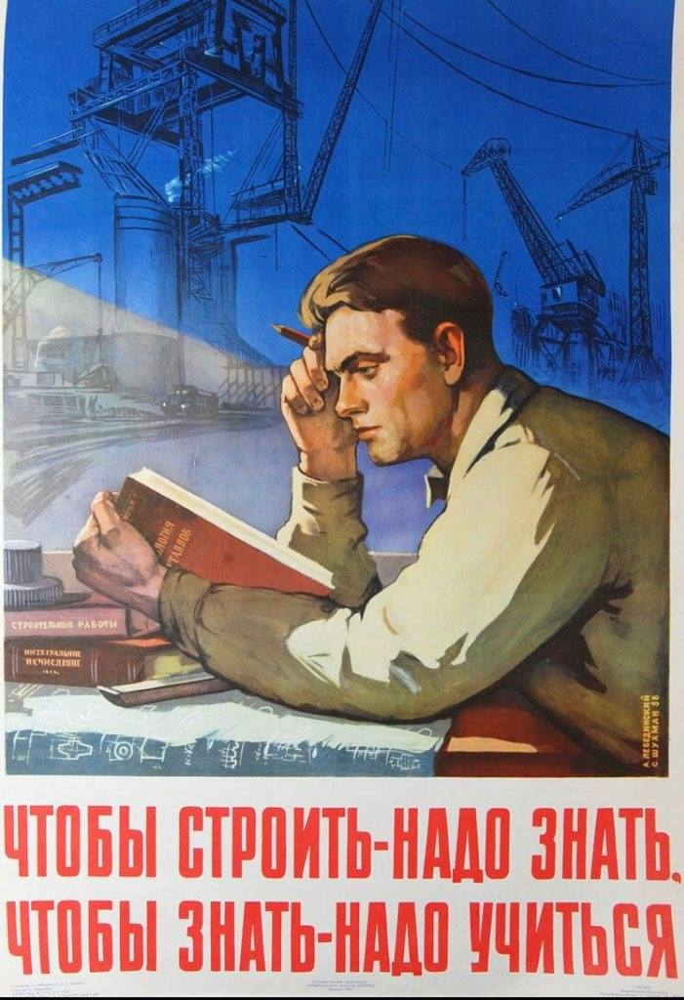
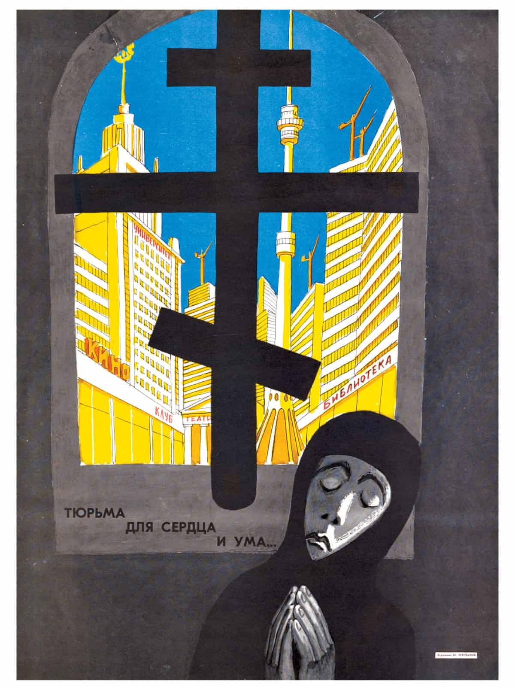

## Thoughts on Communism

The above image is a Soviet Union Poster from the 1950s titled "Building requires knowledge. Knowledge requires study". This repository is inspired by the works of another Github user over [here.](https://github.com/r57zone/Thoughts-on-Communism/blob/master/Thoughts%20on%20Communism.md)

Communism is as much a failed ideology as the hoe is a failed agricultural tool. At the time when we didn’t have horse-drawn plows and high-powered tractors, it carried the day for a lot of people at many places for a lot of time.  If you walk around the countryside in the spring, chances are you’ll still see people picking the soil in their backyards and gardens with hoes. If you go and tell them that they use “a failed tool”, they will be puzzled. Just like the hoe, Communism has its uses. Under a very particular set of circumstances, it happens to work best. When inequality goes off the charts and nations split into bloody-minded packs, when students, housewives and bus drivers foam at the mouth and want to tear each other apart more than anything, State intervention is the answer. Because ultimately, rights come from government, not "God." 

Karl Marx predicted that if the abuses of unrestricted capitalism went on, there would be revolutions by the working class. This was not a radical idea, because the French Revolution had already taken place when he was writing. Defending Capitalism isn’t owning the liberals, rather it is clinging to a dying system. But then why has Communism failed ? Ignoring the US-backed coups in the last 200 years, the main reason is that you  cannot fight Capitalism with a planned, centralized and stubborn political struggle.  For instance, Religion is one form of spiritual oppression which everywhere weighs down heavily upon the masses of the people. Even the bare mention of a citizen’s religion in official documents should unquestionably be eliminated to make it a private affair. If religion is a system of human norms and values that is founded on belief in a superhuman order, then Soviet Communism was no less a religion than Islam. The Buddhist law of nature and Marxist laws of history are superhuman, since they are not legislated by humans. Yet they are not supernatural. And that's the problem with Communism/Socialism. The more you try to fight against private property, the more the enforcers of equality & social justice become the new “exploiters” by a Marxist definition. Then why am I interested in Leftist ideas ? Because the value of a every commodity traded in the market has value only because labour has been abstracted in it. And the task of tracing the genesis of this money form, developing the expression of value implied in the value relation of commodities, from its simplest, almost imperceptible outline, to the dazzling money-form, **has never yet even been attempted by Bourgeois Economy**. As a Marxist, this task is set for us. 

The above image is a propaganda poster from 1920 titled "Reading is one of the duties of man." The USSR in the 1960s-1970s provided a very steep growing curve for anyone with brains, ambition and a sense of higher purpose. And Stalin’s industrialization and universal education inculcated people with a huge respect for cultivation of intellect. The real purpose of socialism is precisely to overcome and advance beyond the predatory phase of human development, economic science in its present state can throw little light on the socialist society of the future. And by merely existing within an economic system does not lead to an understanding of its flaws. This is a complex matter that requires time and dedication. And most people don’t spend their free time reading political theory, philosophy, economics and history.

The above image is another propaganda poster titled "Prison for the heart and mind." Religion is one form of spiritual oppression which everywhere weighs down heavily upon the masses of the people. The Soviet Union was the first state to have as an ideological objective the elimination of religion.  Even the bare mention of a citizen’s religion in official documents should unquestionably be eliminated to make it a private affair. And Soviet art existed with the sole purpose of making people better human beings and the world a better place. A big and mighty machine of the Soviet state relentlessly enforced this, and called it Socialist Realism. Maxim Gorky came to be the favorite novelist of Stalin in the genre of Socialist Realism. “Socialist” means your work has a distinctly political dimension. “Realism” means that your work is grounded in something that exists in reality. **Maxim Gorkey articulated, along with a few other maverick Bolsheviks, a philosophy he called "God-Building" (богостроительство, bogostroitel'stvo), which sought to recapture the power of myth for the revolution and to create a religious atheism that placed collective humanity where God had been and was imbued with passion, wonderment, moral certainty, and the promise of deliverance from evil, suffering, and even death**. Though 'God-Building' was ridiculed by Lenin, Gorky retained his belief that "culture"— the moral and spiritual awareness of the value and potential of the human self—would be more critical to the revolution's success than political or economic arrangements.

We should really aspire to increase the scope and scale of human consciousness in order to better understand what questions to ask. The only thing that makes sense to strive for is greater collective enlightenment. This repository contains all the books and materials I have been reading which cover a wide range of topics like Economics, Business and Startups, Politics and History, Consciousness and Psychedelics etc.

If you have any resources you want to share with me, please feel free to raise an Issue, or email me on srpatil@uci.edu.

